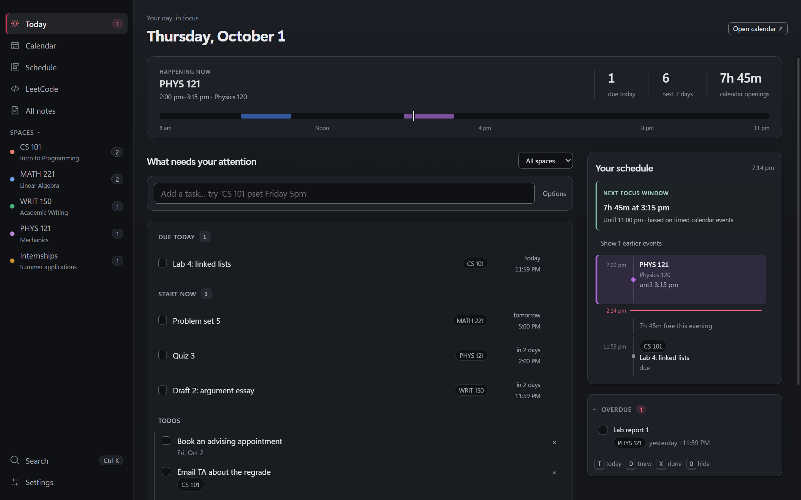
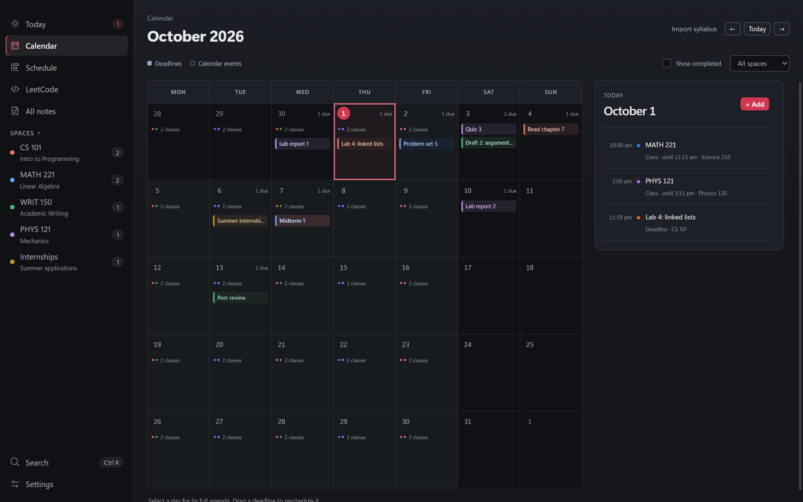
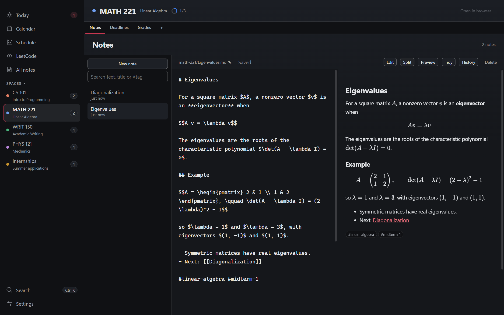
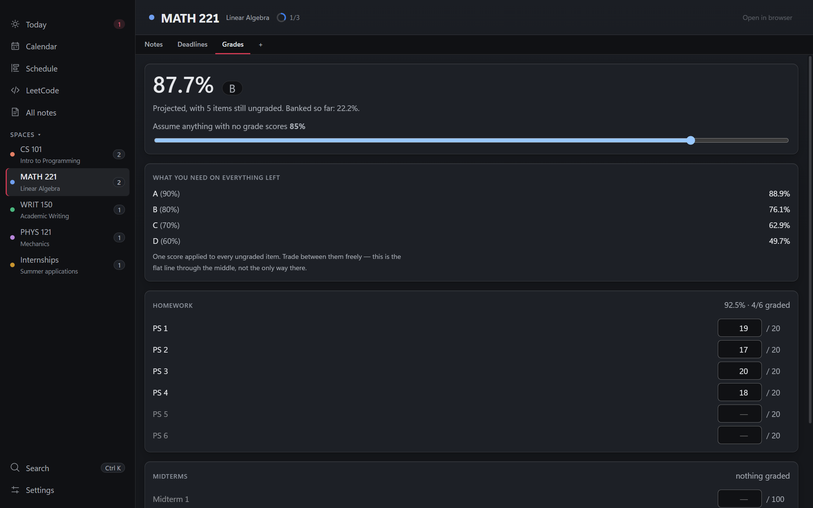

# Tartan

[](https://github.com/Manraj10/tartan/actions/workflows/ci.yml)
[](https://github.com/Manraj10/tartan/releases/latest)
[](https://github.com/Manraj10/tartan/releases)
[](LICENSE)

Your semester in one desktop app: classes, deadlines, notes with LaTeX, grades and your course
sites, side by side. It runs on your machine and keeps everything as plain JSON and Markdown files
you own. No account, no server, no subscription.

**[Download for Windows](https://github.com/Manraj10/tartan/releases/latest/download/Tartan-Windows-Setup.exe)**
· macOS ([Apple silicon](https://github.com/Manraj10/tartan/releases/latest/download/Tartan-macOS-arm64.dmg),
[Intel](https://github.com/Manraj10/tartan/releases/latest/download/Tartan-macOS-x64.dmg))
· Linux ([.deb](https://github.com/Manraj10/tartan/releases/latest/download/Tartan-Linux.deb),
[AppImage](https://github.com/Manraj10/tartan/releases/latest/download/Tartan-Linux.AppImage))



| Calendar | Notes with live math | Grades |
| --- | --- | --- |
|  |  |  |

<sub>Screenshots show an invented semester.</sub>

## Why it exists

Canvas, Gradescope, a professor's hand-rolled course page and your own notes do not live in the same
place. The tools that promise to unify them either cannot embed those sites (most block framing) or
want a Canvas API token to scrape them. Tartan does neither. It opens the real pages in tabs inside
the app and keeps everything else as files in one folder you can read, edit, sync or back up however
you like.

It was built for one student's semester at Carnegie Mellon and works for any school.

## Install

Download the installer for your system from the
[latest release](https://github.com/Manraj10/tartan/releases/latest). The installers are not
code-signed yet, so the first launch needs one extra click:

- **Windows**: run `Tartan-Windows-Setup.exe`. It installs for your user only, with no admin prompt.
  If Windows shows "Windows protected your PC", choose **More info → Run anyway**.
- **macOS**: open the `.dmg` and drag Tartan to Applications. The first time, macOS says it cannot
  check the app; open **System Settings → Privacy & Security** and choose **Open Anyway**. Use the
  `arm64` file on Apple silicon (M1 and later) and `x64` on Intel Macs.
- **Linux**: on Debian or Ubuntu, `sudo apt install ./Tartan-Linux.deb`. Anywhere else, make the
  AppImage executable (`chmod +x Tartan-Linux.AppImage`) and run it. If an AppImage closes straight
  away on Ubuntu 24.04 or later, run it with `--no-sandbox`, or use the `.deb`.

Each release lists SHA-256 checksums in `SHA256SUMS.txt`. Uninstalling never deletes your data
folder or settings.

Every installer is built and checked on GitHub's servers: CI runs the tests and a UI smoke test on
Windows, macOS and Linux, and the release workflow launches each packaged app before publishing it.
Day-to-day use so far has been on Windows 11.

### Run from source

You need [Node.js](https://nodejs.org) 22.12 or newer.

```bash
git clone https://github.com/Manraj10/tartan.git
cd tartan
npm install
npm run dev
```

`npm install` ends by downloading the Electron runtime once (about 150 MB, 360 MB unpacked). If
that download is interrupted, run `node node_modules/electron/install.js` to finish it.
`npm run build` compiles into `out/`, `npm start` runs that build, and `npm run dist` builds an
installer for the machine you are on into `dist/`.

## What it does

- **Today**: what is due today, what to start now, overdue work, your classes and the free time
  between them, with one box to capture anything.
- **Calendar**: a month grid with a full agenda for any day. Add, edit, tick off and drag deadlines.
- **Schedule**: your weekly classes, typed in or pasted from your school's schedule page.
- **Spaces**: one per course (or club, job search, anything). Each has its notes, deadlines, a grade
  sheet and tabs for the sites you use, such as Canvas, Gradescope or the course page.
- **Notes**: Markdown with live KaTeX math, `[[links]]` between notes, `#tags`, search across
  everything, and a history you can restore from.
- **Calendar feeds**: subscribe to any `.ics` link, either to see events or to turn each one into a
  deadline you can tick (a Canvas feed, for example).
- **Recurring work**: type `gym every mon wed` or `quiz every friday 3pm` and it repeats.
- **Grades**: a per-course grade sheet that projects your final grade and what you need on the rest.
- **LeetCode**: a daily practice problem and a 138-problem ladder with progress tracking.
- **Google Calendar sync** (optional): your deadlines and classes on your phone, with reminders. See
  [docs/apps-script/README.md](docs/apps-script/README.md).

## Getting started

The first launch creates your data folder with three placeholder spaces (`01-101`, `02-202` and
`WRIT 101`) so the screens have shape. Then:

1. **Settings → Spaces.** Rename the placeholders or add your own.
2. **Settings → Term dates.** Set the first and last day of your term. Classes show on the Calendar
   and Today only between these dates; the Schedule page always shows every class. Until you set
   them, the term runs 17 weeks from the Monday four weeks before your first launch.
3. **Schedule.** Add each class with *Add class*, or use *Paste schedule* (see Classes).
4. **Deadlines.** Type them into the box on Today (`01-101 pset friday 5pm`), import a syllabus from
   the Calendar page, or subscribe to your Canvas calendar feed (see Calendar feeds).

## Quick add

The box on Today, the quick-capture window and the Todos list all read the same short syntax:

| You type | You get |
| --- | --- |
| `pset 3 friday 5pm` | a deadline this Friday at 5:00 PM |
| `01-101 quiz oct 14 9am` | a quiz in space 01-101 on Oct 14 at 9:00 AM |
| `read chapter 7 tomorrow` | a reading due tomorrow, all day |
| `call the registrar 4pm` | a deadline at 4:00 PM today, or tomorrow if 4 PM has passed |
| `email the TA` | a todo, since there is no date |
| `gym every mon wed` | a repeating todo |
| `quiz every friday 3pm` | a repeating deadline |

- **Dates**: `today`, `tomorrow`, `friday`, `next friday`, `in 3 days`, `oct 5`, `oct 5th`,
  `5th oct`, `5 of october`, `2026-10-05`, `10/5`. A date that has already passed this year means next
  year.
- **Times**: `5pm`, `5:30 p.m.`, `noon`, `midnight` (11:59 PM that day), `at 17:30`. A range such
  as `3-4pm` uses the end.
- **Repeats**: `every day`, `every weekday`, `every mon wed`, `on tuesdays and thursdays`.
- **Spaces**: put a space's code anywhere in the line (`finish CS 101 lab friday`).

Quick add is cautious on purpose. When a line could mean two things (`Homework 3 dec`,
`John 3:16 reading`), it keeps the words in the title instead of guessing a date. Each part it does
recognise shows as a chip you can dismiss before pressing Enter, and the *Options* row sets the
space, date, time or repeat by hand.

## Your data

Everything lives in one folder, `Documents/Semester/` by default. Move it from Settings → Your data →
Change folder (existing files are not copied for you).

```
Semester/
  courses.json        your spaces and their links
  deadlines.json      everything due, including rows imported from feeds
  todos.json          undated tasks
  recurring.json      repeat rules such as "gym every mon wed"
  subscriptions.json  calendar feeds, including their URLs
  grades.json         one grading scheme per space (see Grades)
  leetcode.json       which practice problems you finished, and when
  notes/
    _schedule.md      your weekly classes, one line each (see Classes)
    inbox.md          lines sent from the quick-capture window
    cs-101/*.md       plain Markdown, one file per note
  files/cs-101/       images and attachments pasted into notes
  .versions/          note history
  .cache/feeds/       downloaded feeds and the items you deleted from them
```

That is the whole database. Edit it in any text editor, sync it with anything, or point Claude Code
at it. The app re-reads it when its window comes back into focus, so most outside edits show up when
you switch back. The Schedule page, the Grades tab and the Term dates card read once when you open
them, and an open note is only replaced when you have no unsaved typing.

The JSON files are written to a temporary file and renamed, so a crash mid-save cannot truncate them.
If you break one by hand (a missing comma), Tartan says which file could not be read and refuses to
save over it until you fix or delete it, so a typo never costs you its contents.

Settings that belong to this machine (the data folder location, window size, term dates and the
optional Google sync address and secret) live in `config.json` in Electron's user-data folder, not in
`Semester/`. If that file is ever unreadable, Tartan keeps it as `config.json.bad` and starts fresh.

## Classes

*Add class* on the Schedule page takes a space, day, start, end and room. For a mini course that runs
only part of the term, fill in the optional *From* and *Until* dates.

*Paste schedule* reads two formats:

- the block CMU's student information system (SIO) shows for each section: course title, the
  five-digit number and section, instructor, email, days, times and room;
- one line per class from any school, such as `CS 101 TTh 2:00PM-3:15PM Hall 5`. The space must
  already exist.

For an SIO course number you have no space for, Tartan asks `course.apis.scottylabs.org` for its
title and units. That is a student-run catalog, not a CMU service, and only the course numbers are
sent. Pasting again updates rooms and end times but keeps a room or *From*/*Until* you typed yourself.

Classes are stored in `notes/_schedule.md`, one per line:

```
space-id|day|start|end|room|from|until
cs-101|0|09:00|09:50|Hall 5
cs-102|2|13:00|14:15|Room 210|2026-08-24|2026-10-09
```

`day` is 0 for Monday through 6 for Sunday, times are 24-hour, and `from`/`until` are optional
`YYYY-MM-DD` dates. The first field is the space's id, which is its code made safe for a folder name
(`CS 101` becomes `cs-101`, `Café 101` becomes `cafe-101`). Two spaces cannot share a code.
*Move notes* in Settings renames a space's id everywhere: its notes, classes, deadlines, todos,
repeat rules, feeds, grades and note history.

## Syllabus import

Calendar → *Import syllabus* takes the schedule section of a syllabus or course page and lists every
line with a date. It reads `2026-09-14`, `Sep 14`, `14 September 2026`, `9/14` and `14.09.2026`, with
or without a weekday, and ranges such as `Sep 14 to Sep 18`. When a line has several dates, the one
labelled due wins; otherwise the last one does. The *Year* field defaults to the current year, and a
list that runs from December into January rolls into the next year. Rows already past, or already in
your deadlines, arrive unticked.

## Calendar feeds

Settings → *Calendar subscriptions* holds feeds Tartan keeps fetching: a feed is fetched again once
it is six hours old, checked at launch, when you switch back to the window, and every 15 minutes.
*Refresh all* fetches everything now. Each feed has a mode:

- **Events: just show them.** Campus calendars and holidays appear on the Calendar and Today.
- **Work: make them tickable.** A Canvas feed: each event becomes a deadline you can tick.

Things to know:

- Links can be `https://`, `http://` or `webcal://`; a link with no scheme is read as `https://`.
- Removing a Work feed, switching it off, or switching it to Events deletes its unticked items.
  Ticked items stay. Switching it back on brings them back with your ticks.
- Deleting an imported item keeps it deleted on the next fetch. The list of deleted items is
  `.cache/feeds/dismissed.json`; delete that file to get them back.
- *Import a calendar feed* (also in Settings) copies a feed once. It produces the same rows a Work
  subscription would, remembers nothing about the link, and never refreshes. If you later subscribe
  to the same link, the subscription takes over those rows, so removing it deletes the unticked ones.
- A feed deleted by hand from `subscriptions.json` leaves its rows in `deadlines.json`. Remove feeds
  from Settings instead.
- Canvas ends each title with a section tag such as `[21127]`. When the tag names one of your spaces
  (by id or code), Tartan files the item under that space and removes the tag. Tags that name no
  space stay in the title.
- A feed shows at most 2,000 events, the ones nearest today, and the card says when it cut some. Work
  items cover 30 days back to a year ahead.
- Time zones: one-off events in a named zone (`America/New_York`) land at the right time. A repeating
  event keeps its first occurrence's local time of day, so it can be an hour off when the feed's zone
  and your machine change clocks on different dates. A zone given as a Windows name
  (`Eastern Standard Time`) is read as your local time.
- An Events feed can turn some events into deadlines: add `"promote"` (a regular expression matched
  against the title) and optionally `"promoteExclude"` (matched against `title | location`) to that
  feed in `subscriptions.json`. There is no button for this yet.

## Today and the calendar

Free time on Today counts classes and timed calendar events between 8 AM and 11 PM, in blocks of at
least 45 minutes. Deadlines never count as busy. A feed event with no end time counts as one hour.
All-day events, and timed events longer than 12 hours that cross midnight, are listed under *All day*
and do not count as busy.

On the Overdue card, *→ Today* (or `T`) moves an item to today and keeps its time if that time is
still ahead; if the time has already passed, the item becomes an all-day item for today. `D` moves it
to tomorrow at the same time, and dragging on the Calendar always keeps the time.

## Notes

- Links in a note open in your browser and never take over the app window.
- `$x^2$` is inline math and `$$...$$` is display math. Amounts such as `$5 and $10` stay text,
  because inline math cannot start with a space or end right before a digit. Write `\$` for a
  literal dollar sign anywhere.
- `[[Note title]]` links to another note. `#tag` makes a tag you can search for, and `#math` also
  finds `#math/algebra`. Type `/` for commands such as today's date.
- History: before replacing a note's text, Tartan keeps a copy, at most one every five minutes and
  always before a Restore or a cut of more than half the note. The last 20 copies are kept.
- A Google Doc saved by Drive for desktop leaves a small `.gdoc` file. Put one in a space's notes
  folder and it is listed there by title and opens in your browser. Its contents are not searched.

## Grades

Each space has a Grades tab. The scheme lives in `grades.json` in the data folder, keyed by space id,
and you edit it by hand. The tab offers three starters: *Weighted categories (any course)* starts
with empty categories, and two real CMU syllabi come filled in with that course's assignments, all
ungraded, to show what the format can express.

```json
{
  "cs-101": {
    "label": "Intro to Programming",
    "outOf": 100,
    "categories": [
      { "id": "hw", "label": "Homework", "items": [
        { "id": "hw1", "label": "HW 1", "possible": 10, "earned": 9 },
        { "id": "hw2", "label": "HW 2", "possible": 10, "earned": null }
      ] },
      { "id": "exam", "label": "Exam", "items": [
        { "id": "final", "label": "Final", "possible": 100, "earned": null }
      ] }
    ],
    "formulas": [
      { "label": "Weighted", "expr": { "op": "sum", "of": [
        { "term": { "ref": "hw", "weight": 40 } },
        { "term": { "ref": "exam", "weight": 60 } }
      ] } }
    ],
    "cutoffs": [
      { "label": "A", "min": 90 }, { "label": "B", "min": 80 }, { "label": "C", "min": 70 },
      { "label": "D", "min": 60 }, { "label": "F", "min": 0 }
    ]
  }
}
```

`earned` stays `null` until an item is graded. A term can set `pick` to `all` (the default), `each`,
`lowest`, `rest` or `drop-lowest`, and expressions combine with `sum`, `min` or `max`. When a scheme
has several formulas, the best one counts. A category with no items counts as zero.

If `grades.json` does not parse, the tab shows the error and Tartan refuses to write to the file until
you fix it and press *Check again*. If no formula can be worked out (a typo in a category name, for
example), the grade shows a dash instead of a misleading 0%.

## What it deliberately does not do

No server, account system, relational database or collaboration layer. Your JSON and Markdown files
are the source of truth. The optional Google connection has its own companion phone page; the
desktop app works without it.

## What it does to your machine

Worth knowing before you run it, because a desktop app that lives in the background should say so:

- **Closing the window does not quit it.** Tartan hides to the tray and keeps running, which is what
  lets the optional Google sync work. Quit from the tray menu.
- **Start at login.** Once you save a Google Calendar address in Settings, Tartan adds itself to
  startup one time, hidden, so the sync keeps running. The tray menu's *Start with Windows* (*Start at
  login* on macOS and Linux) checkbox turns it off for good. Running from `npm run dev` never adds it.
- **Two global shortcuts.** `Ctrl/Cmd+Shift+Space` opens the quick-capture window. `Ctrl/Cmd+Shift+Q`
  pastes your clipboard as a quote into the note you have open (made for copying out of PDFs).
- **Site tabs are real browser views.** Signing into Canvas or Gradescope inside a tab stores that
  session in Tartan's own profile, separate from your browser. A sign-in survives quitting Tartan only
  if the site sets a lasting cookie; sites that rely on session cookies ask again next time.
- **The installer** puts Tartan in your user account only (on Windows, `%LOCALAPPDATA%\Programs\tartan`).
  Uninstalling removes the app and leaves your data folder and settings in place.
- **It writes only to your data folder** and its own config. It never phones home. Its own network
  calls are the calendar feeds you add, the course lookup described under Classes, and the Google
  address if you set one. The site tabs, and any image a note links to on the web, load the way they
  would in a browser.

## Keep your feed links private

A Canvas calendar feed URL contains a personal access token, and `subscriptions.json` stores it. Do
not commit your data folder or paste a feed URL anywhere public.

The optional Google sync sends your semester as a whole and deletes calendar events it created but no
longer sees. Read [docs/apps-script/README.md](docs/apps-script/README.md) before pointing it at a
calendar you care about, and point one deployment at one Tartan install.

## Development

```bash
npm run typecheck
npm test
npm run build && npm run test:ui
```

`npm test` runs the parsers, planners and data-file logic without opening a window. `npm run test:ui`
starts the built app in a temporary profile with sample data and network requests blocked, and checks
saving, editing, filtering, navigation, small windows and failed writes without touching your real
files.

Bug reports and pull requests are welcome: see [CONTRIBUTING.md](CONTRIBUTING.md), and report
security problems privately as described in [SECURITY.md](SECURITY.md). Changes are listed in
[CHANGELOG.md](CHANGELOG.md).

## Credits

The LeetCode ladder links to [NeetCode](https://neetcode.io) and LeetCode. The company names beside
each problem come from public GitHub datasets: liquidslr/leetcode-company-wise-problems, krishnadey30,
hxu296 and snehasishroy. Problem titles belong to LeetCode. Course titles and units come from the
student-run [ScottyLabs](https://scottylabs.org) course API.

## Licence

MIT. See [LICENSE](LICENSE).
